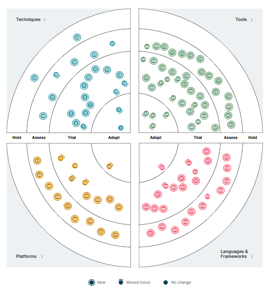

# general-information

## Overview

1.2 dan 1.3 dari pdf

## How to Define

Untuk membuat pedoman standarisasi library, Telkomsel membutuhkan framework dan workflows untuk memastikan kelancaran dan konsistensi operasional. Langkah pertama adalah menentukan apakah sebuah library cocok untuk dipilih sebagai library standar. Sebuah matriks diperlukan untuk memproses library baru menjadi library terpilih. Selain itu, workflow juga diperlukan untuk menyesuaikan standar yang ada dan untuk mengesampingkannya.

### Library Selection

For library selection, we utilize a matrix to gauge the library's market strength:

| Aspect        | Criteria                                       | Weight | Score     |
|---------------|------------------------------------------------|--------|-----------|
| Maintenance   | - 4 → within weeks                             | 0.1 - 1| 1 - 4     |
|               | - 3 → last month                               |        |           |
|               | - 2 → last 6 months                            |        |           |
|               | - 1 → last year                                |        |           |
| Reputable     | - 4 → worldwide known company                  | 0.1 – 1| 1 – 4     |
|               | - 3 → local known company                      |        |           |
|               | - 3 → worldwide known developer/team           |        |           |
|               | - 2 → local known developer/team               |        |           |
|               | - 1 → unknown developer                        |        |           |
| Compatibility | - 4 → very compatible                          | 0.1 – 1| 1 - 4     |
|               | - 3 → moderate compatible                      |        |           |
|               | - 2 → compatible with workaround               |        |           |
|               | - 1 → not compatible                           |        |           |
| Community     | - 4 → worldwide and local user                 | 0.1 – 1| 1 - 4     |
|               | - 3 → worldwide user                           |        |           |
|               | - 2 → local user                               |        |           |
|               | - 1 → few user                                 |        |           |
| Documentation | - 4 → web documented                           | 0.1 – 1| 1 - 4     |
|               | - 3 → md documented                            |        |           |
|               | - 2 → in source code documented                |        |           |
|               | - 1 → no documentation                         |        |           |
| Licensing     | - 4 → opensource                               | 0.1 – 1| 1 – 4     |
|               | - 3 → opensource with support                  |        |           |
|               | - 2 → pay to get the source                    |        |           |
|               | - 1 → pay not getting source                   |        |           |
| Extensible    | - 4 → easily extended                          | 0.1 – 1| 1 - 4     |
|               | - 3 → moderately extended                      |        |           |
|               | - 2 → hard to extend                           |        |           |
|               | - 1 → cannot be extended                       |        |           |
| Size          | - 4 → <10mb                                    | 0.1 – 1| 1 - 4     |
|               | - 3 → <100mb                                   |        |           |
|               | - 2 → <500mb                                   |        |           |
|               | - 1 → <1gb                                     |        |           |

Berikut adalah elaborasi dari setiap aspek yang tercantum di atas :

1. **Maintenance (Pemeliharaan)**  
   Menjelaskan seberapa sering library diperbarui dan status build terkini.

2. **Reputable (Reputasi)**  
   Mencerminkan seberapa dikenal pemelihara library, baik di tingkat lokal maupun internasional, serta persepsi publik.

3. **Compatibility (Kesesuaian)**  
   Menunjukkan kesesuaian library dengan arsitektur saat ini dan sistem warisan yang telah ada di Telkomsel.

4. **Community (Komunitas)**  
   Mendeskripsikan keterlibatan komunitas dengan library, apakah secara luas digunakan atau hanya digunakan oleh sekelompok kecil pengguna.

5. **Documentation (Dokumentasi)**  
   Menilai kelengkapan dokumentasi library, termasuk tutorial dan konsep dasar.

6. **Licensing (Lisensi)**  
   Membahas tentang syarat lisensi library, apakah bersifat open-source atau memerlukan pembayaran untuk mengaksesnya.

7. **Extensible (Keekstensifan)**  
   Mengevaluasi potensi library untuk dikembangkan dengan teknologi yang akan datang.

8. **Size (Ukuran)**  
   Memperhitungkan ukuran pustaka, karena ukuran yang lebih besar dapat meningkatkan biaya dalam lingkungan berbasis cloud.

## Tech Radar

Tech Radar adalah konsep atau alat yang digunakan untuk memantau dan mengkategorikan teknologi berdasarkan tingkat adopsi dan kelayakan penggunaannya dalam suatu organisasi atau industri. Konsep ini membantu organisasi dalam pengambilan keputusan terkait teknologi dengan menyediakan pandangan visual yang jelas tentang tren dan perkembangan dalam dunia teknologi.

Radar ada dalam bentuk grafis, mengelompokkan item-item ke dalam techniques, tools, platforms, dan languages and frameworks. Ketika item Radar bisa berada di banyak kuadran, maka pilih salah satu yang tampak paling tepat. Selanjutnya kelompokkan item dalam empat cincin untuk mencerminkan posisi mereka.

- Adopt: Teknologi yang telah terbukti berhasil dan diadopsi secara luas. Organisasi diharapkan untuk mengadopsi teknologi ini dengan percaya diri.
- Trial: Teknologi yang menunjukkan potensi nilai tinggi dan layak diuji dalam proyek-proyek kecil atau lingkup terbatas.
- Assess: Teknologi yang mungkin memiliki nilai, tetapi belum matang atau diuji sepenuhnya. Perlu dilakukan evaluasi lebih lanjut sebelum diadopsi secara luas.
- Hold: Teknologi yang telah mengalami pergeseran tren atau tidak lagi dianggap sebagai pilihan yang baik untuk diadopsi.

### Reference
- [Tech Radar](https://www.thoughtworks.com/radar)
